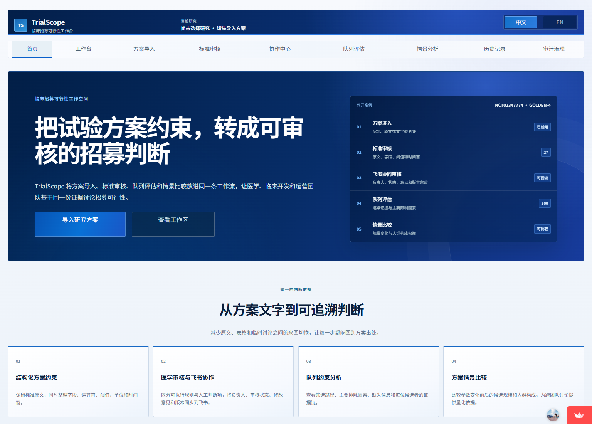
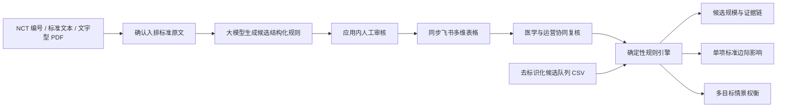
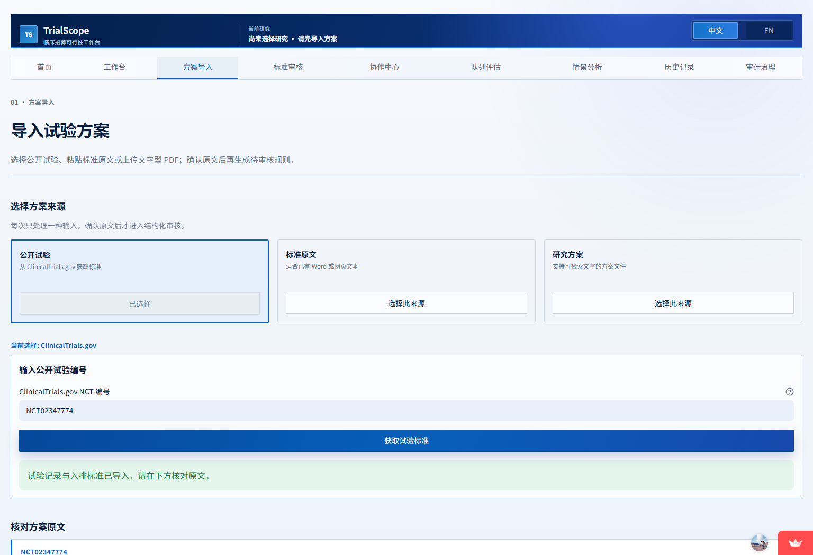
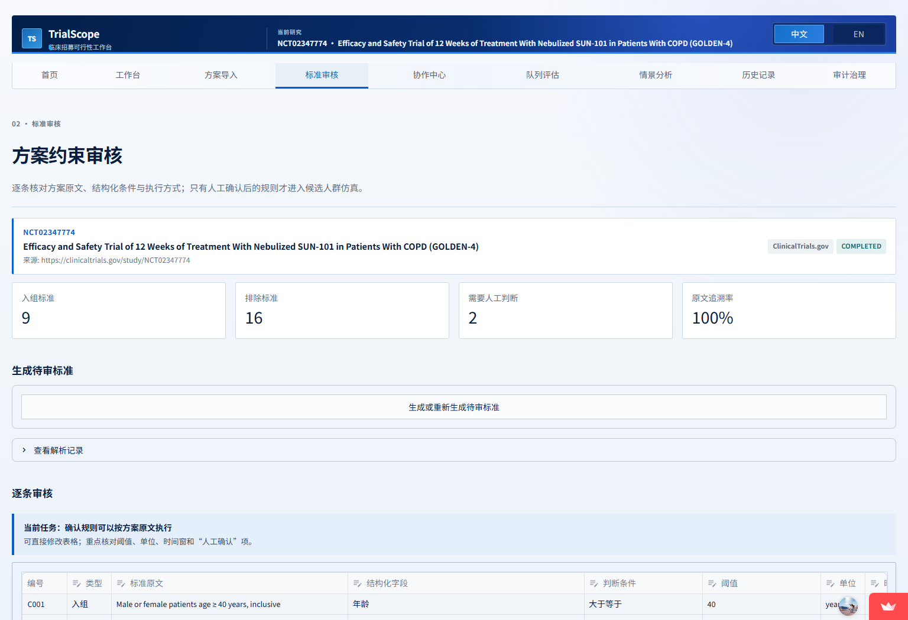
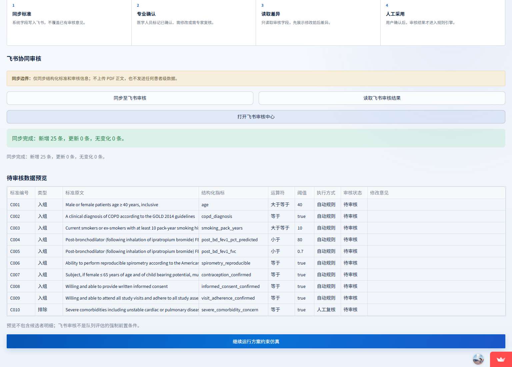
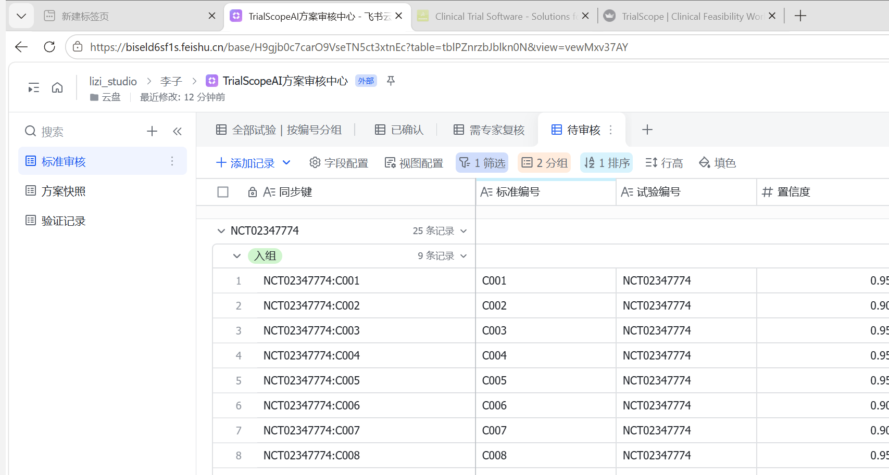
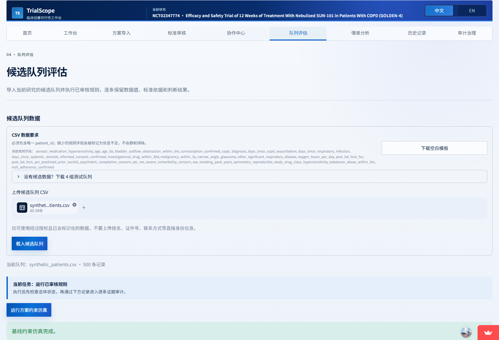

# TrialScopeAI

> 2026 AI 先锋未来人才大赛 · 健康元药业企业命题 · 40 强赛参赛作品<br>
> 临床试验方案约束仿真与招募可行性协同决策平台

**[在线体验](https://trialscopeai.streamlit.app/)** ｜ **[40 强赛参赛方案 PDF](docs/TrialScopeAI_40强赛参赛方案.pdf)** ｜ **[公开演示研究 GOLDEN-4](https://clinicaltrials.gov/study/NCT02347774)**



## 我们想解决的问题

一份临床试验方案进入多中心执行前，团队通常已经知道“招募可能很难”，却不容易马上回答几个更具体的问题：

- 哪些入排条件对候选规模影响最大？
- 哪些字段在真实筛选中最容易缺失？
- 某项条件变化后，候选人群构成会怎样改变？
- 医学、统计和运营人员如何围绕同一版规则协作，而不是各自维护表格？

TrialScopeAI 将自然语言入排标准转成可审核、可执行的结构化规则，再用候选队列进行方案约束仿真。系统输出候选规模、主要筛减条件、数据未决负担、人群代表性变化和情景权衡，帮助团队在方案执行前把问题讨论得更具体。

它不是一个自动入组工具，也不替代研究者、统计人员或伦理委员会。

## 从方案文本到协同决策



我们的边界划分很明确：**模型负责理解，规则负责执行，专业人员负责审核。** 大模型不会直接决定某位候选者是否入组；缺失字段标记为“信息不足”，主观标准保留为“人工复核”。

## 当前版本已经实现

| 环节 | 当前能力 | 可核验结果 |
|---|---|---|
| 方案导入 | NCT 编号、粘贴文本、文字型 PDF | 导入后先展示原文，确认后才解析；扫描件不生成猜测结果 |
| 标准结构化 | 字段、运算符、阈值、单位、时间窗、逻辑组、原文来源 | Pydantic 二次校验，每条规则保留来源和审核状态 |
| 人工审核 | 修改结构化结果、标记人工判断、保存审核版本 | 未确认的标准不会直接进入正式仿真 |
| 飞书协同 | 标准同步、审核状态回读、修改意见、审核人和版本留痕 | 网站写入字段与飞书审核字段分离，回读差异后仍需人工确认 |
| 队列评估 | 上传候选队列 CSV，执行确定性规则 | 输出规则符合、不符合、信息不足、人工复核及逐条证据链 |
| 方案分析 | 招募漏斗、排除原因、缺失字段、代表性、边际影响 | 回答每项约束对候选规模与人群构成的影响 |
| 情景权衡 | 同时比较规模、代表性和数据未决负担 | 呈现取舍，不自动建议放宽方案 |
| 研究管理 | 浏览器内研究历史、阶段恢复、操作时间线 | 不保存上传的 PDF 原文件和候选者明细 |
| 双语界面 | 中文和英文两套业务表达 | 不只是逐句翻译，导航、说明与表格按语言重新排版 |

## 真实端到端演示记录

2026 年 8 月 16 日，我们使用公开研究 **NCT02347774（GOLDEN-4）** 完成了一次从导入到飞书审核台的完整测试：

1. 从 ClinicalTrials.gov 获取登记信息与入排标准；
2. 通过 DeepSeek 实时解析得到 25 条待审核规则，其中入组 9 条、排除 16 条，2 条保留人工判断；
3. 在应用内核对原文、字段、阈值、单位和时间窗；
4. 首次同步至飞书审核中心，新增 25 条记录；
5. 导入 500 条固定随机种子的合成 COPD 候选记录，运行方案约束仿真。

这里的 **25 条**是本次真实在线解析按当前规则粒度生成的候选标准；仓库中的 **27 条人工金标准**用于回归测试，两者用途不同，不能直接写成模型准确率。

### 1. 输入 NCT 编号并确认公开来源



### 2. 结构化结果进入人工审核



### 3. 同步到飞书审核中心



飞书不是额外的展示页，而是承担审核状态、审核人、修改意见和版本留痕的协作工作区。



### 4. 导入合成候选队列并运行仿真



## 评委体验路径

打开 **[在线系统](https://trialscopeai.streamlit.app/)** 后，建议按以下顺序体验：

1. 在首页查看 GOLDEN-4 公开案例和五阶段工作流；
2. 进入“方案导入”，输入 `NCT02347774`；
3. 在“标准审核”查看结构化结果和原文追溯；
4. 在“协作中心”查看飞书同步与审核回读方式；
5. 在“队列评估”下载测试队列，或使用 [`sample_data/`](sample_data/) 中的四组虚构数据；
6. 在“方案分析”查看漏斗、排除原因和单项标准边际影响；
7. 切换中英文界面，观察业务说明和表格布局的差异。

正式工作区默认保持空白，不会自动载入案例、规则或候选队列。首页案例只用于解释产品能力。

## 已完成的验证

| 验证资产 | 当前结果 | 说明 |
|---|---:|---|
| 真实 NCT 端到端测试 | 1 个 | GOLDEN-4，从公开来源导入到飞书审核台 |
| 本次实时解析 | 25 条规则 | 9 条入组、16 条排除、2 条需人工判断 |
| 人工审核金标准 | 27 条 | 覆盖字段、运算符、阈值、单位、时间窗与原文来源 |
| 来源追溯 | 100% | 每条候选规则均保留标准原文与来源 |
| 合成候选队列 | 500 条 | 固定随机种子，可重复生成，不含真实患者信息 |
| 独立边界病例 | 50 个 | 覆盖等号、单位、缺失、时间窗、主观标准与多重失败 |
| 自动化测试 | 65 项通过 | 覆盖规则、PDF、NCT、模型响应、飞书、历史、分析和完整应用路径 |
| 真实患者记录 | 0 条 | 当前版本不采集、不处理个人医疗信息 |

结构化提取 F1 ≥ 0.85、患者匹配准确率 ≥ 90% 仍是下一阶段正式评测目标，不是已经实现的企业效果。真实效率提升需要在健康元专业人员参与的试点中测量。

## 为什么加入飞书

临床方案标准通常需要医学、统计、运营等角色共同确认。网站适合完成解析、仿真和分析，飞书多维表格则适合承接：

- 标准负责人和审核状态；
- 修改意见与人工备注；
- 结构化字段的版本变化；
- 情景分析快照；
- 真实试点中的耗时与一致性验证记录。

系统只同步结构化标准和汇总信息，不上传 PDF 正文或候选者级明细。飞书中的修改回读网站后，还需要再次人工确认才会更新当前规则。

## 医疗与数据安全边界

- 不诊断、不自动入组，不直接建议修改临床试验方案；
- 大模型只进行语义提取，不直接决定候选者资格；
- PDF 在当前会话内存中处理，不保存上传文件或正文；
- 首版不支持扫描 PDF OCR，无法提取有效文本时明确提示；
- 情景结果只是基于当前导入队列的规则模拟；
- 真实数据接入必须经过合法授权、去标识化、医学验证和伦理审批。

## 本地运行

要求 Python 3.12。

```powershell
python -m venv .venv
.\.venv\Scripts\Activate.ps1
python -m pip install -r requirements.txt
streamlit run app.py
```

运行测试：

```powershell
python -m pip install -r requirements-dev.txt
python -m pytest
```

敏感配置只放入本地或 Streamlit Secrets，不进入仓库。可参考 [`.streamlit/secrets.example.toml`](.streamlit/secrets.example.toml)。

## 项目结构

- `app.py`：单入口 Streamlit 工作台；
- `src/trial_sources.py`：NCT、文本和内存 PDF 导入；
- `src/llm_parser.py`：DeepSeek JSON 解析、校验、缓存与限额；
- `src/feishu.py`：飞书鉴权、标准同步、审核回读与验证记录；
- `src/rules.py`：确定性规则、状态优先级与证据链；
- `src/analytics.py`：漏斗、代表性、边际影响和多目标情景权衡；
- `src/history.py`：浏览器研究工作区、时间线与恢复；
- `data/`：公开案例、人工金标准和合成数据；
- `sample_data/`：四组可直接下载的虚构测试队列；
- `tests/`：离线自动化验收；
- `docs/TrialScopeAI_40强赛参赛方案.pdf`：最终参赛报告。

## 团队

| 成员 | 学校与专业 | 项目分工 |
|---|---|---|
| 朱春兰 | 复旦大学 · 预防医学 | 医学含义、流行病学逻辑、数据质量、人群代表性和研究边界 |
| 李朝元 | 成都理工大学 · 测控技术与仪器 | 数据导入、结构化解析、规则引擎、飞书协同、可视化、测试和部署 |

我们的专业背景分别对应这个问题的两部分：先判断哪些医学与人群问题值得分析，再把分析过程做成能够复现和检查的产品。联系方式已在报名系统填写，不在公开仓库重复展示。

## 公开来源

- [ClinicalTrials.gov Data API](https://clinicaltrials.gov/data-api/about-api)
- [GOLDEN-4 registry record](https://clinicaltrials.gov/study/NCT02347774)
- [FDA: Enhancing Participation in Clinical Trials](https://www.fda.gov/regulatory-information/search-fda-guidance-documents/enhancing-participation-clinical-trials-eligibility-criteria-enrollment-practices-and-trial-designs)
- [DeepSeek JSON Output](https://api-docs.deepseek.com/guides/json_mode/)
- [飞书多维表格 OpenAPI](https://open.feishu.cn/document/server-docs/docs/bitable-v1/bitable-overview)

## 免责声明

TrialScopeAI 当前版本面向临床试验方案评估与招募可行性协作，不是医疗器械。任何真实患者筛选、方案修改或运营决策，均需由有资质的专业人员在完成数据治理、医学验证和伦理审批后进行。
