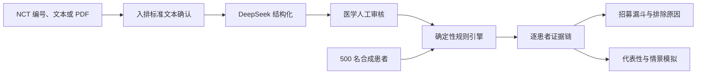

# TrialScopeAI

> 临床试验入排标准结构化与招募可行性评估助手

TrialScopeAI 将临床试验方案中的自然语言入排标准转换为可审核、可执行的规则，在合成患者队列中模拟预筛，展示招募漏斗、主要排除原因、缺失信息、人群代表性和条件调整后的变化。

本项目面向药企临床开发、医学与运营团队。它不是诊断或患者入组系统，不使用真实患者数据，也不替代研究者、统计人员和伦理委员会。

- 在线演示：[trialscopeai.streamlit.app](https://trialscopeai.streamlit.app/)
- 大赛材料：[TrialScopeAI 大赛提交材料](output/pdf/TrialScopeAI_大赛提交材料.pdf)

## 演示闭环



主演示案例采用公开 COPD Ⅲ期试验 [GOLDEN-4（NCT02347774）](https://clinicaltrials.gov/study/NCT02347774)。仓库包含一份来源明确、可搜索的两页演示 PDF，以及审核后的 27 条结构化标准。

## 核心功能

- 通过 ClinicalTrials.gov NCT 编号导入公开试验；
- 粘贴入排标准，或上传不超过 20 MB、200 页的可搜索 PDF；
- 自动定位 Inclusion / Exclusion / Eligibility Criteria 章节；
- DeepSeek V4 JSON Output + Pydantic 校验；
- 人工修改字段、运算符、阈值、单位、时间窗和适用条件；
- 确定性规则引擎输出“模拟符合 / 不符合 / 信息不足 / 人工复核”；
- 为每个结论保留患者值、规则阈值、标准原文和原因；
- 招募漏斗、主要排除项、缺失字段和人群代表性分析；
- 年龄、吸烟史、肺功能、氧疗与时间窗的 What-if 情景比较；
- JSON、CSV 和 Markdown 结果下载；
- 无网络或无 API Key 时仍可运行完整缓存演示。

首版有意不做扫描 PDF OCR、真实电子病历接入、登录系统、数据库和自动方案修改。

## 快速启动

要求 Python 3.12。

```powershell
python -m venv .venv
.\.venv\Scripts\Activate.ps1
python -m pip install -r requirements.txt
streamlit run app.py
```

打开终端显示的本地地址，默认即为可完整使用的 GOLDEN-4 缓存案例。

### 配置 DeepSeek

1. 复制 `.streamlit/secrets.example.toml` 为 `.streamlit/secrets.toml`；
2. 填入新生成的 DeepSeek Key；
3. 不要提交 `secrets.toml`。

```toml
DEEPSEEK_API_KEY = "your-new-key"
DEEPSEEK_MODEL = "deepseek-v4-flash"
ENABLE_LIVE_LLM = true
```

实时解析包含三层费用保护：每会话最多三次、进程每小时最多三十次、相同文本哈希缓存。可随时在 Streamlit Secrets 中将 `ENABLE_LIVE_LLM` 改为 `false`，保留缓存演示而关闭付费接口。

## 数据与评测

| 资产 | 数量 | 用途 |
|---|---:|---|
| GOLDEN-4 金标准规则 | 27 条 | 结构与原文追溯 |
| 合成 COPD 候选患者 | 500 人 | 招募漏斗与代表性模拟 |
| 独立边界病例 | 50 例 | 阈值、缺失、复核和优先级测试 |
| 真实患者数据 | 0 | 不采集、不处理 |

合成队列使用固定随机种子 `20260716`，用于功能验证而非流行病学估计。数据分布不代表真实 COPD 人群，也不能据此推断实际招募率。

运行测试：

```powershell
python -m pip install -r requirements-dev.txt
python -m pytest
```

当前 40 项自动化测试覆盖规则运算符、50 个边界病例、PDF 解析异常、NCT 映射、DeepSeek 模拟响应、限额/缓存、情景分析和无 Key 的 Streamlit 启动。
GitHub Actions 会在 `main` 更新和 Pull Request 上使用 Python 3.12 自动运行同一套测试。

## 架构

- `app.py`：单入口 Streamlit 工作流与交互状态；
- `src/trial_sources.py`：NCT、文本和内存 PDF 导入；
- `src/llm_parser.py`：DeepSeek JSON 解析、校验、缓存和限额；
- `src/rules.py`：确定性规则、结果优先级和证据链；
- `src/analytics.py`：漏斗、阻断因素、代表性、情景和报告；
- `src/synthetic.py`：可复现合成队列与边界病例；
- `data/`：公开试验摘要、金标准规则和合成数据；
- `output/pdf/`：经过渲染复检的演示 PDF；
- `tests/`：离线自动化验收。

## Streamlit Community Cloud

1. 登录 [Streamlit Community Cloud](https://share.streamlit.io/)；
2. 选择 `liziyaaa/TrialScopeAI`、`main` 和 `app.py`；
3. Python 版本选 3.12；
4. 在 Advanced settings 的 Secrets 中填写新 Key 和上述配置；
5. 部署后将 `streamlit.app` 链接填入比赛材料。

Cloud 部署通过网页完成；`streamlit run app.py` 是本地开发命令。详细步骤见 [Streamlit 官方文档](https://docs.streamlit.io/deploy/streamlit-community-cloud/deploy-your-app/deploy)。

## 医疗与安全边界

- 仅使用 ClinicalTrials.gov 公开记录和明确标注的合成患者；
- PDF 在内存中处理，不持久化上传文件或正文；
- 大模型只提取标准，不直接判断患者资格；
- 主观、缺失或无法执行的标准不会静默判为不符合；
- 情景结果仅用于方案讨论，必须经过医学、统计和伦理审核；
- 所有可执行规则均保留标准原文和来源链接。

## 公开来源

- [ClinicalTrials.gov Data API](https://clinicaltrials.gov/data-api/about-api)
- [GOLDEN-4 registry record](https://clinicaltrials.gov/study/NCT02347774)
- [DeepSeek API](https://api-docs.deepseek.com/)
- [DeepSeek JSON Output](https://api-docs.deepseek.com/guides/json_mode/)
- [Streamlit Community Cloud](https://docs.streamlit.io/deploy/streamlit-community-cloud)

## 免责声明

TrialScopeAI 是比赛原型，不是医疗器械或生产级临床系统。任何真实患者筛选、试验方案修改或运营决策，均需在获得合法授权、数据治理、医学验证和伦理批准后进行。
