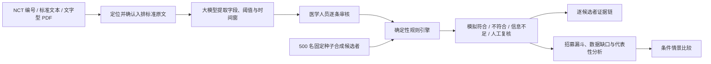

# TrialScopeAI

> **2026 AI先锋未来人才大赛 · 健康元药业企业命题**<br>
> 临床试验入排标准结构化与招募可行性评估助手

我们希望回答一个具体问题：**一份复杂的临床试验方案进入多中心执行前，能否先看清哪些入排标准最影响招募、哪些患者信息容易缺失，以及潜在参与人群是否发生偏移？**

TrialScopeAI 将方案中的自然语言入排标准转为可审核规则，在合成候选者队列中进行可解释的模拟预筛，并展示招募漏斗、主要筛减原因、数据缺口、人群代表性与条件情景变化。

**[在线体验](https://trialscopeai.streamlit.app/)** ｜ **[大赛提交材料 PDF](output/pdf/TrialScopeAI_大赛提交材料.pdf)** ｜ **[主演示方案 GOLDEN-4](https://clinicaltrials.gov/study/NCT02347774)**

> 在线演示默认载入经过审核的 GOLDEN-4 案例，**无需 API Key 即可完成标准审核、500 人模拟预筛、证据查看与招募分析**。


## 为什么选择这个问题

临床试验招募并不只是“患者数量不足”。方案中的年龄、肺功能、合并症、用药史、检查阈值与时间窗通常以长篇自然语言呈现，人工逐条解释耗时，不同研究中心也可能产生执行差异。过严、难执行或依赖缺失字段的条件，还会缩小候选人群并影响研究人群的代表性。

因此，我们没有尝试覆盖临床试验全流程，而是聚焦健康元临床开发中一个**可量化、可获得数据、可由学生团队完成原型验证**的环节：

1. 把入排标准从“只能阅读的文本”转成“可以审核的规则”；
2. 在不使用真实患者数据的情况下模拟执行，提前定位主要筛减条件；
3. 从预防医学视角观察缺失数据、选择偏倚与人群代表性风险；
4. 为医学、统计和运营团队提供可追溯的讨论依据，而不是替他们作决定。

## 我们做了什么



主演示采用公开 COPD Ⅲ期试验 [GOLDEN-4（NCT02347774）](https://clinicaltrials.gov/study/NCT02347774)。该方案同时包含年龄、吸烟史、肺功能、用药、合并症和时间窗，适合验证从方案导入到招募评估的完整闭环。

## 评委 2 分钟体验路径

打开 **[在线演示](https://trialscopeai.streamlit.app/)** 后，可按以下顺序体验：

1. **项目概览**：查看四项任务、当前研究和原型结果；
2. **02 标准审核**：浏览 27 条结构化标准，核对原文、字段、阈值、单位、时间窗和执行方式；
3. **03 模拟预筛**：点击“运行模拟预筛”，再点击任一候选者，查看每条标准的患者值、判断原因与方案原文；
4. **04 招募评估**：查看筛减漏斗、主要未通过标准、缺失字段和人群代表性；
5. 展开**情景比较**，调整年龄、吸烟包年、FEV1 或时间窗，观察候选人数和构成变化。

若希望体验输入能力，可在 **01 方案导入** 中选择 NCT 编号、粘贴标准原文、上传文字型 PDF，或重新载入内置演示。

## 当前已经实现

| 能力 | 当前实现 | 评委可验证的结果 |
|---|---|---|
| 方案导入 | NCT 编号、粘贴文本、文字型 PDF、内置案例 | 原文确认后才进入解析，不对扫描件生成猜测结果 |
| 标准结构化 | 提取字段、运算符、阈值、单位、时间窗、适用条件与原文来源 | GOLDEN-4 提供 27 条人工审核标准 |
| 医学审核 | 可逐条修改结构化结果，主观标准标为人工确认 | 保存后才进入模拟预筛 |
| 确定性预筛 | 输出“模拟符合 / 不符合 / 信息不足 / 人工复核” | 每个结论保留患者值、标准值、原因和原文 |
| 招募评估 | 漏斗、主要筛减项、缺失字段、年龄/性别/疾病程度代表性 | 可定位最主要的候选池损失环节 |
| 情景比较 | 年龄、吸烟史、FEV1、FEV1/FVC、氧疗和时间窗 | 比较候选人数与人群构成变化 |
| 结果导出 | 结构化标准 JSON/CSV、预筛结果 CSV、评估摘要 Markdown | 结果可继续用于汇报与复核 |
| 离线演示 | 无网络或无 API Key 时使用审核后的缓存案例 | 核心评审路径不依赖外部服务稳定性 |

## 核心创新点

### 1. 模型理解，规则执行，人最终审核

我们没有让大模型直接判断患者能否入组。大模型只负责把自然语言转成结构化候选规则；Pydantic 负责结构校验；医学人员负责确认；最终预筛由确定性规则引擎执行。这让结果可以复核、复现和追责。

### 2. 每个结果都有证据链

系统不只输出“符合/不符合”，还展示：标准编号、方案原文、患者值、标准值、执行结果和判断原因。缺失字段输出“信息不足”，主观标准输出“人工复核”，不会被静默处理成排除。

### 3. 把预防医学能力放进临床开发场景

除了候选人数，我们还关注数据完整性、选择偏倚和人群代表性。通过比较候选队列与潜在参与人群的年龄、性别和疾病程度，帮助团队讨论某些标准可能带来的人群构成变化。

### 4. 首版不依赖难以获得的医院数据

当前使用 ClinicalTrials.gov 公开方案、人工审核规则与合成候选者，能够在合规、低成本条件下验证产品闭环。未来只有在企业授权、伦理审批和数据治理到位后，才考虑接入去标识化历史筛选统计。

## 当前验证证据

| 资产或检查 | 当前结果 | 说明 |
|---|---:|---|
| GOLDEN-4 人工审核规则 | 27 条 | 覆盖类型、字段、运算符、阈值、单位、时间窗和原文来源 |
| 合成 COPD 候选者 | 500 名 | 固定随机种子 `20260716`，结果可复现 |
| 独立边界病例 | 50 个 | 覆盖阈值相等、缺失值、单位、时间窗、主观标准和多重失败 |
| 自动化测试 | 40 项通过 | 覆盖规则、PDF、NCT、模型模拟响应、缓存限额、分析和 Streamlit 完整路径 |
| 真实患者记录 | 0 条 | 当前不采集、不处理个人医疗信息 |

结构化提取 F1 ≥ 0.85、患者匹配准确率 ≥ 90% 是下一阶段验收目标，**不是我们已经实现的企业效果**。真实效率提升还需要在健康元医学、统计与运营人员参与的试点中测量。


## 对健康元的预期价值

TrialScopeAI 希望在方案讨论和招募准备阶段，为健康元团队提供三个更早出现的信号：

- **方案可执行性**：哪些标准最严格、最主观或最依赖难获得字段；
- **招募准备优先级**：哪些筛减环节值得优先准备数据、检查流程与中心培训；
- **人群代表性风险**：条件调整前后，潜在参与人群构成可能如何变化。

它不是自动修改方案的工具，而是把原本分散在方案文本、人工经验和筛选记录中的信息，整理成可量化、可追溯的讨论材料。

## 团队分工与命题契合度

我们是一支“预防医学 + 技术实现”的互补团队：

- **预防医学方向**：负责临床标准理解、流行病学逻辑、数据质量、人群代表性与医疗安全边界；
- **技术方向**：负责 PDF/NCT 数据管道、大模型结构化、规则引擎、合成数据、可视化、测试与部署。

这也是我们选择健康元赛道的原因：项目既需要医学视角判断“什么值得分析”，也需要工程能力把分析过程做成可复现产品。

## 医疗与数据安全边界

- 不诊断、不自动入组，不替代研究者、统计人员或伦理委员会；
- 大模型只进行语义提取，不直接决定候选者资格；
- PDF 在当前会话内存中处理，不保存上传文件或正文；
- 首版不支持扫描 PDF OCR，无法提取有效文本时明确提示；
- 所有情景结果均为合成模拟，不构成临床试验方案修改建议；
- 任何真实数据接入都必须经过合法授权、去标识化、医学验证和伦理审批。

## 技术实现与复现

<details>
<summary><strong>本地运行</strong></summary>

要求 Python 3.12。

```powershell
python -m venv .venv
.\.venv\Scripts\Activate.ps1
python -m pip install -r requirements.txt
streamlit run app.py
```

默认即可运行完整 GOLDEN-4 缓存案例。

</details>

<details>
<summary><strong>可选：配置 DeepSeek 实时结构化</strong></summary>

复制 `.streamlit/secrets.example.toml` 为不进入版本控制的 `.streamlit/secrets.toml`：

```toml
DEEPSEEK_API_KEY = "your-new-key"
DEEPSEEK_MODEL = "deepseek-v4-flash"
ENABLE_LIVE_LLM = true
```

实时解析包含会话限额、进程小时限额和文本哈希缓存，可随时关闭并保留缓存演示。

</details>

<details>
<summary><strong>运行测试</strong></summary>

```powershell
python -m pip install -r requirements-dev.txt
python -m pytest
```

GitHub Actions 会在 `main` 更新和 Pull Request 上使用 Python 3.12 运行同一套测试。

</details>

主要模块：

- `app.py`：单入口 Streamlit 工作台；
- `src/trial_sources.py`：NCT、文本和内存 PDF 导入；
- `src/llm_parser.py`：DeepSeek JSON 解析、校验、缓存与限额；
- `src/rules.py`：确定性规则、结果优先级与证据链；
- `src/analytics.py`：漏斗、筛减原因、代表性和情景比较；
- `src/synthetic.py`：可复现合成队列与边界病例；
- `data/`：公开试验摘要、金标准规则与合成数据；
- `tests/`：离线自动化验收。

## 公开来源

- [ClinicalTrials.gov Data API](https://clinicaltrials.gov/data-api/about-api)
- [GOLDEN-4 registry record](https://clinicaltrials.gov/study/NCT02347774)
- [FDA: Enhancing the Diversity of Clinical Trial Populations](https://www.fda.gov/regulatory-information/search-fda-guidance-documents/enhancing-diversity-clinical-trial-populations-eligibility-criteria-enrollment-practices-and-trial)
- [DeepSeek API](https://api-docs.deepseek.com/)
- [DeepSeek JSON Output](https://api-docs.deepseek.com/guides/json_mode/)

## 免责声明

TrialScopeAI 是参赛原型，不是医疗器械或生产级临床系统。任何真实患者筛选、方案修改或运营决策，均需由有资质的专业人员在完成数据治理、医学验证和伦理审批后进行。
